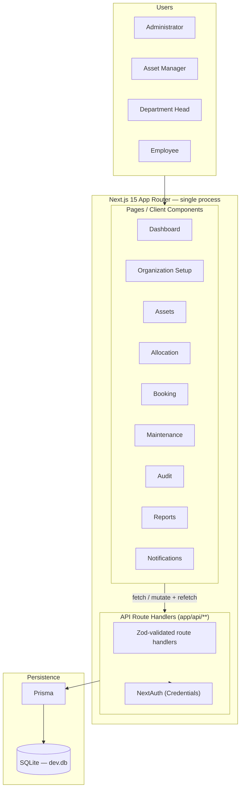
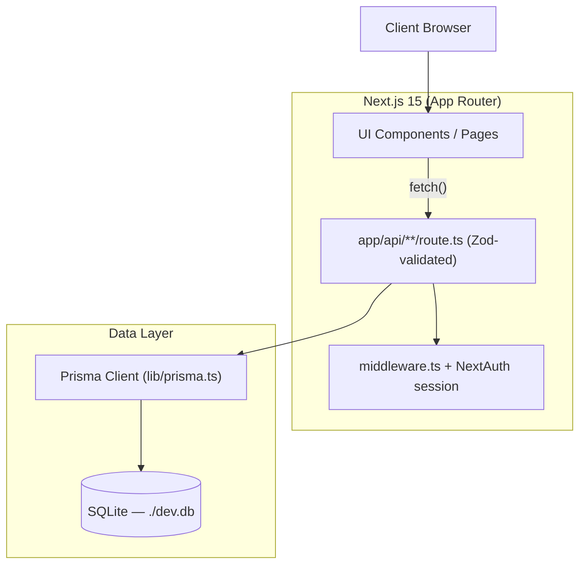
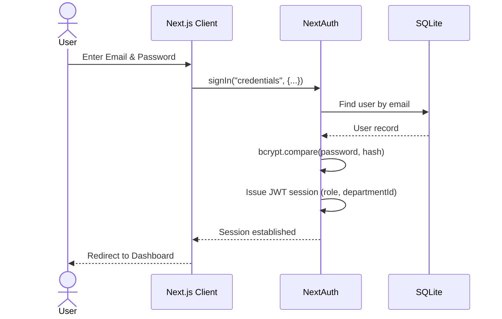
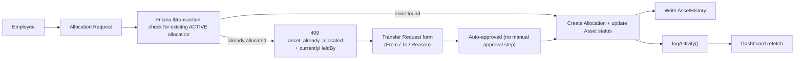
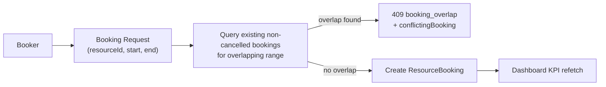
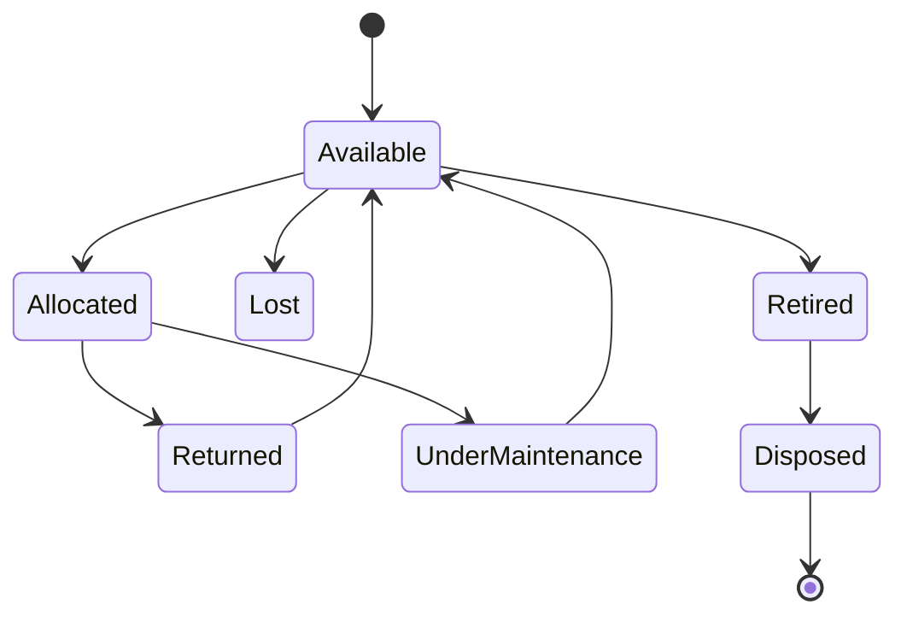
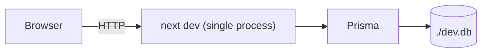

# AssetFlow

**Enterprise Asset & Resource Management System** — a centralized platform for tracking, allocating, and maintaining physical assets and shared resources (equipment, furniture, vehicles, rooms) across any organization.

Built for Odoo Hackathon in a 6-hour build window — a single self-contained Next.js app, no Docker, no separate backend service.

---

## Architecture

AssetFlow runs as **one Next.js 15 application** — client, server, and API all in a single process. There is no separate Express service, no Socket.IO server, no Docker, and no Postgres. Data lives in a local SQLite file (`prisma/dev.db`). This is a deliberate scope-down from a larger 4-service architecture to fit a 6-hour, 3-person build: fewer moving parts to wire together during the build means more time on the two features that actually matter for the demo (double-allocation conflict handling, booking overlap prevention).

---

## High-Level System Architecture



No Socket.IO — the UI refetches after a mutation (e.g. after an allocation or booking succeeds) instead of subscribing to live push events. For a 6-hour demo this is materially simpler to build and just as convincing live.

---

## Layered Architecture



There's no separate controller/service/repository layering and no rate-limiting middleware — route handlers call Prisma directly, with the two flagship-feature checks (allocation conflict, booking overlap) pulled into small helper functions (`lib/allocations.ts`, `lib/bookings.ts`) rather than a formal service layer.

---

## Authentication Flow



Auth is handled by NextAuth's Credentials provider with a JWT session strategy — there's no hand-rolled JWT signing/verification and no separate `/auth/login` route; NextAuth's `[...nextauth]` route handler covers it.

---

## Asset Allocation Workflow (flagship demo #1)



Enforced inside a single Prisma `$transaction` (check-then-create), not via a database-level partial unique index — SQLite/Prisma doesn't support declaring that constraint in the schema for this stack, so the transaction is the actual source of truth. Tested by firing two allocation requests back-to-back against the same asset and confirming only one succeeds.

---

## Resource Booking Overlap (flagship demo #2)



Same shape as the allocation check — a same-pattern query-then-create, no DB-level exclusion constraint (SQLite has no equivalent to Postgres `EXCLUDE USING gist`). Correctness rests on the application-layer check being airtight; this is why it's cross-tested by a second team member before the 4:00 sync.

---

## Asset Lifecycle



---

## Deployment / Local Run



One process, one command, no containers to explain during the demo.

---

## Cross-Cutting Design Principles

| Principle | Implementation |
|---|---|
| Local-first | SQLite file on disk, zero external services |
| Authentication | NextAuth Credentials provider + bcrypt |
| Authorization | Role checks in route handlers + `middleware.ts` redirect for unauthenticated users |
| Validation | Zod schemas in `lib/schemas.ts`, shared between forms (React Hook Form resolver) and API routes |
| Database | Prisma ORM against SQLite |
| Real-time | None — refetch-on-mutation instead of Socket.IO |
| File storage | None — photo upload cut from scope for the 6-hour build |
| Logging | `ActivityLog` table + shared `logActivity()` helper called from every mutation |
| Error handling | Per-route try/catch returning `{ error, message, field }`, not a global Express error middleware |
| Security | Zod validation + bcrypt + role checks. No rate limiting — cut for build speed |

---


## Tech Stack

| Layer | Technology | Notes |
|---|---|---|
| Framework | Next.js 15 (App Router) | Full-stack — pages and API routes in one app |
| Language | TypeScript | |
| UI | Tailwind CSS, shadcn/ui | |
| State | Zustand | Client-side state where needed beyond server data |
| Forms | React Hook Form + Zod resolver | Inline field-level errors |
| Resource booking UI | Custom static day-grid | Not react-big-calendar — a styled grid of hour rows, built by hand |
| Charts | Recharts | Utilization + maintenance-frequency charts, cut to plain tables first if behind schedule |
| ORM | Prisma | Type-safe schema + migrations |
| Database | SQLite (local file, `prisma/dev.db`) | No Docker, no cloud DB |
| Auth | NextAuth (Credentials provider) + bcryptjs | JWT session strategy; signup always creates an Employee account |
| Validation | Zod | Shared schemas, `lib/schemas.ts` |

---

## Project Structure

```
assetflow/
├── app/
│   ├── (routes)/              # login, dashboard, assets, bookings, etc.
│   ├── api/                   # route handlers: auth, assets, allocations, bookings, ...
│   └── page.tsx               # redirects to /login
├── components/                 # shared UI (sidebar, StatCard, Table, etc.)
├── lib/
│   ├── prisma.ts               # Prisma client singleton
│   ├── schemas.ts              # Zod schemas (per-module, added by whoever owns that route)
│   ├── logActivity.ts          # shared activity-log helper
│   ├── allocations.ts          # allocation conflict-check transaction
│   └── bookings.ts             # booking overlap-check
├── prisma/
│   ├── schema.prisma
│   ├── seed.ts
│   └── dev.db                  # local SQLite file (gitignored — each teammate generates their own)
├── types/
│   └── next-auth.d.ts          # session/user type augmentation
├── middleware.ts                # auth redirect for unauthenticated users
├── auth.ts                      # NextAuth config
└── README.md
```

---

## Getting Started (Windows / PowerShell)

### Prerequisites
- Node.js 20+
- npm


### 1. Clone and install

```powershell
git clone <repo-url>
cd assetflow
npm install
```

### 2. Configure environment variables

Create a `.env` file at the project root:

```
AUTH_SECRET="replace-with-a-long-random-string"
```

Generate one quickly if you don't have one:
```powershell
npx auth secret
```

### 3. Run migrations + seed

```powershell
npx prisma generate
npx prisma migrate dev --name init
npx prisma db seed
```

### 4. Start the app

```powershell
npm run dev
```

Visit `http://localhost:3000` — it redirects straight to `/login`.

**One command block for the whole team, no Docker to explain:**
```powershell
npm install && npx prisma migrate dev && npx prisma db seed && npm run dev
```

---

## Data Model Reference

| Entity | Key Fields | Constraint / Index |
|---|---|---|
| `User` | email, passwordHash, role, departmentId, status | `email` unique; role assignment writable only via Admin-guarded `/api/employees/:id/promote` |
| `Department` | name, parentDeptId, headId, status | Self-referencing FK for hierarchy (hierarchy UI itself is cut unless time allows) |
| `AssetCategory` | name, customFields (stored as JSON string — SQLite has no native JSON type via Prisma) | |
| `Asset` | assetTag, categoryId, serialNumber, condition, location, isBookable, status | `assetTag` and `serialNumber` unique; indexed on `status`, `categoryId` |
| `AssetHistory` | assetId, fromStatus, toStatus, actorId, reason | Immutable log of every lifecycle transition |
| `Allocation` | assetId, holderId, expectedReturnDate, status | Only one `ACTIVE` allocation per asset — enforced via a Prisma `$transaction` check-then-create, **not** a DB-level partial unique index (unsupported declaratively on this stack) |
| `TransferRequest` | assetId, fromHolderId, toHolderId, status | Requested → auto-approved → re-allocated (manual approval step cut) |
| `ResourceBooking` | resourceId, bookerId, startTime, endTime, status | Overlap rejected via an application-layer query-then-create check, no DB-level exclusion constraint |
| `MaintenanceRequest` | assetId, requesterId, priority, status, technicianId | Pending → Approved → Technician Assigned → In Progress → Resolved (button-based stage moves, no drag-and-drop) |
| `AuditCycle` | name, scopeType, scopeId, startDate, endDate, status | Single implicit auditor (whoever's logged in), no multi-auditor assignment |
| `AuditFinding` | cycleId, assetId, auditorId, status (Verified/Missing/Damaged) | Closing a cycle flips any `MISSING` finding's asset to `LOST` |
| `Notification` | userId, type, message, relatedResourceType/Id, isRead | Read from `ActivityLog`, no live push |
| `ActivityLog` | actorId, action, resourceType, resourceId, changes (JSON string) | Immutable audit trail; every mutation calls `logActivity()` |

Full schema lives in `prisma/schema.prisma`.

---

## API Conventions

Base URL: `/api` (Next.js route handlers under `app/api/`)

**Response envelope**
```json
// List endpoints
{ "data": [ /* ... */ ], "total": 42 }

// Single-resource endpoints
{ "id": 1, "field": "value" }

// Errors
{ "error": "machine_readable_code", "message": "Human readable", "field": "email" }
```

**Session**: handled by NextAuth's JWT session cookie — no manual `Authorization: Bearer` header to attach client-side.

**Representative endpoints**

| Method | Route | Auth | Purpose |
|---|---|---|---|
| `POST` | `/api/auth/signup` | Public | Creates an **Employee** account only — role is hard-coded server-side, never taken from the request body |
| — | `/api/auth/[...nextauth]` | Public/Session | NextAuth's own login/session endpoints |
| `GET`/`POST`/`PUT`/`DELETE` | `/api/departments` | Admin (write) | Department management |
| `POST` | `/api/employees/:id/promote` | Admin only | The only place a role is ever assigned; rejects `ADMIN` as a target role |
| `GET`/`POST` | `/api/assets` | Asset Manager (write) | Register + search/filter by tag, serial, category, status |
| `POST` | `/api/allocations` | Asset Manager, Dept Head | Returns `409` with `currentlyHeldBy` if already allocated |
| `POST` | `/api/allocations/:id/return` | Holder/Asset Manager | Marks an allocation returned, flips asset back to `AVAILABLE` |
| `POST` | `/api/bookings` | Any | Returns `409` with `conflictingBooking` on overlap |
| `POST`/`PATCH` | `/api/maintenance-requests` | Any / Asset Manager | Raise + approval workflow transitions |
| `POST` | `/api/audit-cycles` | Admin | Create cycle |
| `PATCH` | `/api/audit-cycles/:id/findings` | Auditor | Verified / Missing / Damaged |
| `POST` | `/api/audit-cycles/:id/close` | Admin | Locks cycle, flips Missing → Lost |
| `GET` | `/api/reports/*` | Admin, Managers | Utilization, maintenance frequency |

---

## Core Domain Rules

- **Asset lifecycle**: `Available → Allocated → Under Maintenance → Available`, plus `Available → Lost/Retired → Disposed`, logged to `AssetHistory` on every change.
- **No double-allocation**: enforced inside a Prisma `$transaction` (check-then-create) — there is no DB-level partial unique index on this stack, so the transaction boundary is the actual guarantee. Verified by firing two concurrent allocation requests against the same asset in testing.
- **Booking overlap prevention**: checked at the API layer before insert — no DB-level exclusion constraint (SQLite doesn't support one declaratively via Prisma). Verified the same way: an adjacent booking succeeds, an overlapping one is rejected.
- **Non-self-elevating signup**: signup always creates an Employee account, regardless of what's submitted in the request body. Only an Admin, via the promote endpoint, can move someone to Asset Manager or Department Head — and that endpoint explicitly rejects `ADMIN` as a target role.
- **Email validation**: Zod format check shared between the signup form and the API route — no disposable-domain blocklist (cut from scope).
- **No real-time push**: after any mutation (allocation, transfer, booking, maintenance stage change), the frontend refetches the affected data — no Socket.IO subscription.

---

## User Roles

| Role | Capabilities |
|---|---|
| **Admin** | Departments, categories, audit cycles, employee/role promotion, org-wide reports |
| **Asset Manager** | Register/allocate assets, approve transfers/maintenance/audit discrepancies, approve returns |
| **Department Head** | View dept assets, approve dept allocation/transfer requests, book shared resources |
| **Employee** | View own assets, book resources, raise maintenance requests, initiate return/transfer |

---

## Screens

1. Login / Signup
2. Dashboard (KPIs, overdue highlights, quick actions)
3. Organization Setup (Departments, Categories, Employees) — Admin only
4. Asset Registration & Directory
5. Asset Allocation & Transfer — **flagship demo #1**
6. Resource Booking (custom day-grid, overlap validation) — **flagship demo #2**
7. Maintenance Management (kanban, button-based stage moves)
8. Asset Audit (cycles, discrepancy reports)
9. Reports & Analytics
10. Activity Logs & Notifications

---
